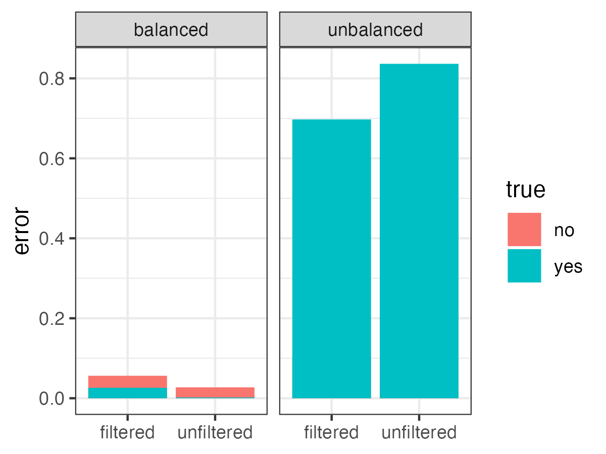
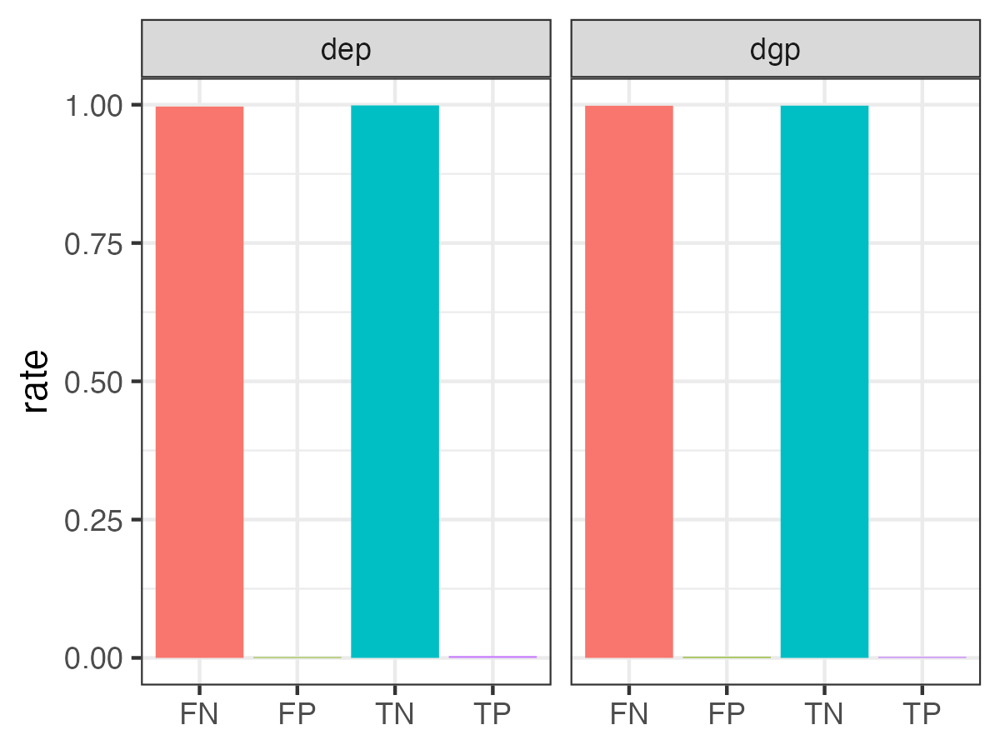
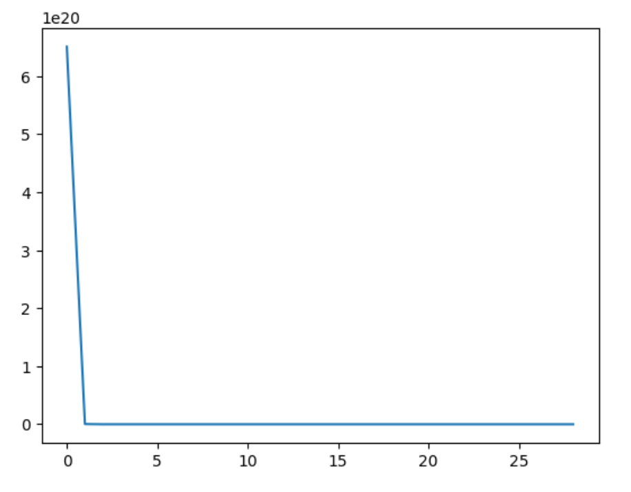

```{r setup, include=FALSE}
knitr::opts_chunk$set(echo = FALSE)
library(kableExtra)
library(tidyverse)
```

# Background

Species diversity is a key component of bio-diversity. Understanding why there are numerous species on the Earth requires to understand speciation, that is the process by which a single species of organism splits into two distinct species. This process has occurred over the history of Earth and is driven by various mechanisms such as geographical isolation, reproductive isolation, hybridization, and natural selection [@wu2004genes]. Two major compatible theories about the drivers of speciation have gained popularity: isolation-by-distance (IBD) model predicts that geographical distance can create difficulties for individuals of the same species in exchanging genetic materials (e.g. mating) and thus genetic distance should be positively correlated with geographical distance [@Felsenstein1976popgen]; isolation-by-environment(IBE) model treats differences in environmental factors more seriously than barely geographical distances by emphasizing the role of local adaptation of individuals living in a different environment than its original habitat, and thus genetic distance should be more strongly correlated with environmental distance [@sexton2014genetic].

IBD and IBE are both valuable in the theory of speciation, but they inform little to conservation. Governments and organizations can only perform conservation given important factors that drives speciation on a board scale, and protecting such factors would help to preserve bio-diversity. In this project, I try to address the question of what factors better explain genetic distances among various species using machine learning. This work is built based on the work of Pelletier and Carstens [@pelletier2018geographical]. In their paper, they first did matrix correlation tests of genetic distances versus geographical distances(IBD) and environmental distances(IBE) in 8955 species and then used random forest to uncover important predictors that contribute to the accuracy in predicting IBD and/or IBE. Here, I will first perform a random forest analysis using their labeled data set generated by statistical tests and then try to use neural network as a substitute of the random forest, and using raw p-value instead of transformed labels are response variables.

# Material and methods

## Data retrieval and preprocessing

Data were retrieved from [here](https://datadryad.org/stash/dataset/doi:10.5061/dryad.q1j20) on Dec 1 2022.The data set is corrupted by EXCEL as `#NAME?` appears 444 times in the file, although the conclusions they drew should be relatively robust to deleting these corrupted rows.

Redundant variables, such as statistics generated by Mantel tests and low-level taxonomies, are removed, and p-values `pmtp` are transformed to `Yes/No` labels by a threshold of 0.05. No correction is done. `n` is the number of individuals whose genetic sequences were used to infer genetic structure. Low `n` suggests the inference of genetic structure is not reliable. In their paper, it's shown that `n>=20` guarantees reliable results, which is also implemented in my scripts. The labeled data set is highly unbalanced because of the intrinsic property of p-values, a balanced data set is generated by sampling from positive and negative cases with equal number.

All taxonomic variables were excluded in the data set for neural network because keeping just a few board taxonomic labels does not reflect the phylogenetic relationships anyway. `metabolism` and `habit` were hot encoded as they are string type. An empirical threshold of `n > 5` was applied because the distribution of p-value is converging to stability when `n > 5` (Figure \@ref(fig:appendix1)), and excluded `n` for further analysis. Applying a threshold of statistical significance is at risk of losing information and introducing human bias. Instead, the p-values were kept as response variables in neural network to indicate the intensity of signals of IBD and IBE. P-values for both IBD (`gdp`) and IBE (`gep`) are included, instead of only IBD (`pmtp`) to test two hypothesis independently.

## Random forest

Random forest uses decision trees to predict the response label by voting. Each tree is grown on a bootstrapped data set from the input, which only contains 150 data points with 5 predictors. Importance of each predictor is evaluated by a permutation approach. The value of a predictor is permuted, and the more important a predictor is, the more mean accuracy will decrease due to permutation. A confusion matrix was calcualted. Accuracy of random forests trained on original data, unbalanced data filtered by `n>=20`, unfiltered balanced data and filtered balanced data were compared. Implementation of random forest and importance analysis are from `R` package `randomForest`[@rf2002].

## Neural network

After preprocessing, the training set includes 36 predictors and 2 response variables. To address inbalance in the training set, data points with `p<0.05` are included three times in the training set and positive rates for two p-values are relatively the same. `MLPRegressor` from `sklearn` was used to build neural network regression model [@scikitLearn]. The number of layers and neurons are decided through a grid search. The search space has maximum 3 layers, maximum 36 neurons and minimum 4 neurons per layer, and the increment is set to 4. 3-fold cross validation was used to compare model performance. Model with best CV was used for downstream analysis. Although accuracy is not defined in the regression model, I still used `0.05` as a threshold to transform predicted p-value to `true/false` label and calculated confusion matrix for both p-values. In the importance analysis, each variable is permuted and correlation between predicted Y and true Y are calculated. Columns of a hot encoded variable are permuted together. The mean decrease correlation are used to indicate the importance of a variable.

# Result and Discussion

## Random forest

```{r accuracyRF, fig.show="hold", fig.align="center", fig.cap="Erro rates of random forests built on filtered/unfiltered balanced/unbalanced data sets. Filtering is to reduce noice in genetic structure inference, and balancing positive/negative training cases is to reduce bias of training accuracy. Colors denote true labels, where red means IBD or IBE and blue means no genetic structure."}

```

After removing redundant variables, the original data set has 41 predictors, 1 response variable and 12252 data points. However, the proportion of positives is low (14.9%), and therefore training on original data set will likely be biased towards minimizing false positives and render low sensitivity. Besides, `n` as the number of individuals of a species used to infer genetic structure will also affect the reliability of labels (training noise), and noisy data would also create difficulty in training random forests.

Here I applied filtering and balancing to the training set, and compared their accuracy based on true labels. Despite decent overall accuracy (85.5%), random forests perform poorly in terms of high false negative rates, when training data set is unbalanced (Figure \@ref(fig:accuracyRF)). After re-sampling the original data set with equal number of positives and negatives, the overall error rate is reduced and the bias towards false negative is eliminated.

Filtering has opposite effect on balanced and unbalanced data set. In unbalanced data set, after apply filtering `n` the error rate is reduced, mainly on false negatives, while in balanced data set, filtering increased false negative rates, although false negative rates and false positive rates are close, which means the bias is also reduced. Filtering can reduce noise in the original data set, but it also reduce the amount of data. Therefore, the net effect of filtering is dependent on the trade off between the number of data available and the noise. It seems reasonable to apply a more soft filtering criteria to keep more data, which is done in the next section.

```{r MDARF}
MDA <- readRDS("../Rscripts/MDA.RDS")
knitr::kable(MDA %>% head(),
             caption = "Mean decrease accuracy of predictors.") %>% 
  kable_styling(latex_options = "hold_position")
```

A similar result, though not precisely the same as in the original paper, of important variables is generated from data set that is balanced and filtered by `n>=20`. Except for `n`, all of the variables are geological factors (Table \@ref(tab:MDARF)), which supports IBD. Although I have applied filtering to reduce the noise introduced by the number of individuals used to infer genetic distance, it's still an important variable as it ranked second from the list, which indicates the intrinsic noise in the methodology. As the genetic sequences were not originally generated for the propose of this study, `n` is out of control in this database-mining study. Further attention should be paid to controlling confounding factors related to experiment design.

## Neural Network

```{r confusionNN, fig.show="hold", fig.align="center", fig.cap="Confusion matrix of best neural network model. Predicted p-values and true p-values are transformed to labels by threshold of 0.05"}

```

After applying `n>=6`, the training set has 8210 data points, 34 numeric predictors and 2 hot encoded predictors. Through grid search, the best neural network architecture by CV has 3 hidden layers and 4, 8, 36 neurons for each hidden layers. Although data points with low p-values have been duplicated to address bias in the training set, the model still has false negative rates (Figure \@ref(fig:confusionNN)), when p-values are transformed to labels by a threshold of 0.05. This could be because the p-value is not linear. The difference between significant p-values are small as they are all cluster around 0, and therefore log space can be more sensitive to small changes of p-values. On the other hand, when p-values are not significant, it is close to linearity. Therefore, the non-linearity when p-value is close to 0 and linearity when close to 1 would punish false negatives harsher than false positives, because a p-value slightly bigger than 0.05 is acceptable by regression but it makes a huge difference when drawing statistical conclusions. This brings back to the discussion of accepting a threshold of p-value for making statistical inferences. Otherwise, one can also use a loss function that is sensitive to small p-values. The mean square error used here does not capture information in data points with low p-values and but they contribute great information about the variables contributing to strong signal. The model is also under-trained, which is reflected by the loss curve of training (Appendix figure \@ref(fig:appendix2)), whose loss stablizes after few epochs.

```{r importanceNN, fig.show="hold", out.width="49%", fig.align="center", fig.cap="Mean decrease correlation of variables of IBD and IBE."}
knitr::include_graphics(c("img/importance_dgp_plot.png", "img/importance_dep_plot.png"))
```

Importance of variables for the neural network is evaluated by mean decrease of correlation between predicted p-values and true p-values, when each variable is permuted. Both IBD and IBE shows strong influence by geographical factors, in which longitude has strongest importance for both (Figure \@ref(fig:importanceNN)). Although the conclusion drawn is similar to that from random forest, it is noteworthy that the MDC is below 0.05 for all variables. This means in the neural network it's not very sensitive to changes to any variables. It could be because the model is under-trained. Theoretically, if model is fully trained, such a pattern can indicate sophisticated interactions between variables influencing genetic structures so that each variable independently contributes little to the whole model.

In conclusion, it is shown from both random forest and neural network that geographical distribution of organisms is important for maintaining the genetic diversity. On a board scale, biological conservation should be conducted in a board geographical range across continents, rather than keeping a few biodiversity hot spots.

# Code availability

R markdown is used to prepare data, run random forest and knit the report, and Jupyter notebook is used for neural network. For codes of all sections:

-   Random forest: `Rscripts/random_forest.Rmd` and its pdf output `Rscripts/random_forest.pdf`

-   Data preparation for neural network: `Rscripts/data_preparation_NN.Rmd` and its pdf output `Rscripts/data_preparation_NN.pdf`

-   Neural network: `PythonScripts/NN.ipynb` for majority of analysis, and computational intensive parameter search is in `PythonScripts/gridSearchLayerNeuron_reg.py`. Pdf report is `PythonScripts/NN.pdf`

-   Report: `report/report.Rmd` and pdf report `report/report.pdf`

\newpage

# Appendix

```{r appendix1, fig.show="hold", out.width="49%", fig.align="center", fig.cap="Histogram of p-values of IBD and IBE by different n"}
knitr::include_graphics(c("img/dgp_hist.png", "img/dep_hist.png"))
```

```{r appendix2, fig.show="hold", out.width="50%", fig.align="center", fig.cap="Loss curve of best fit neural network"}

```

# Reference
